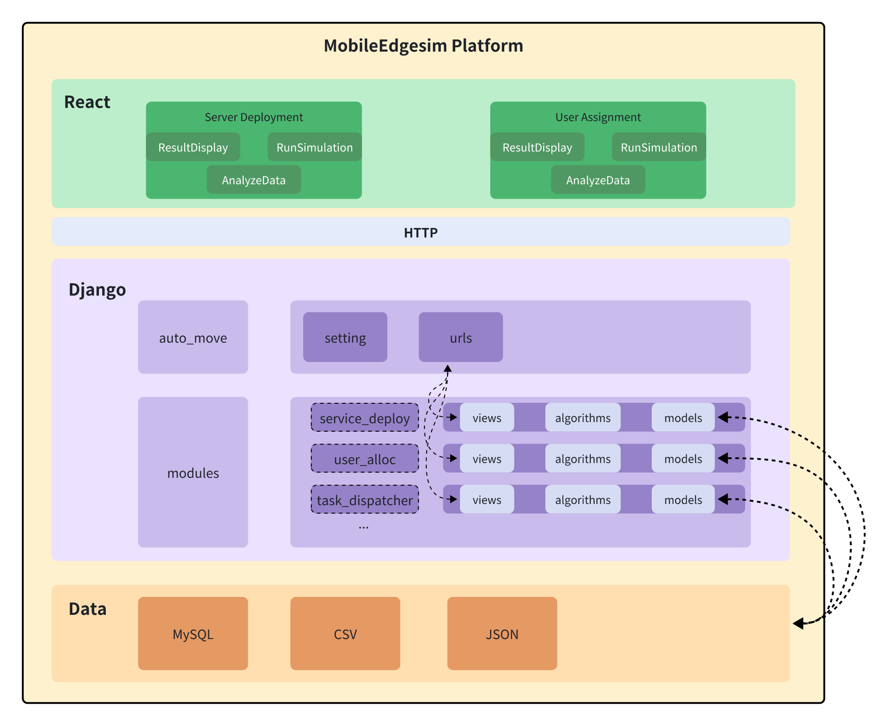
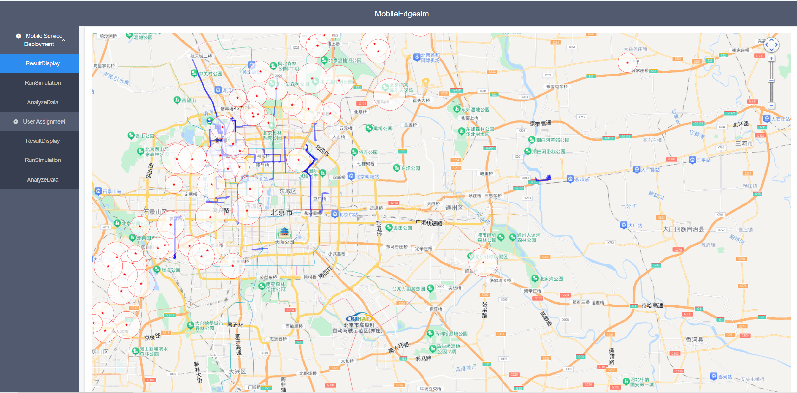
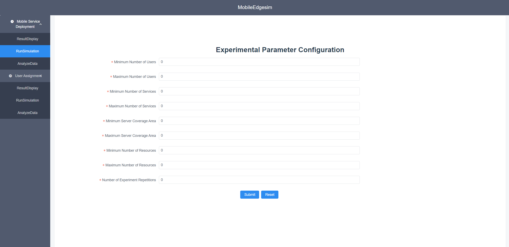
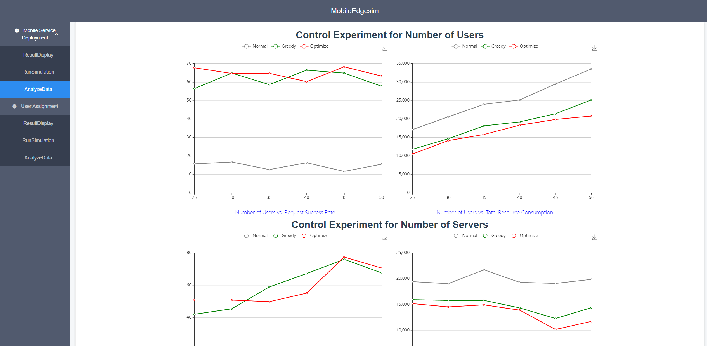
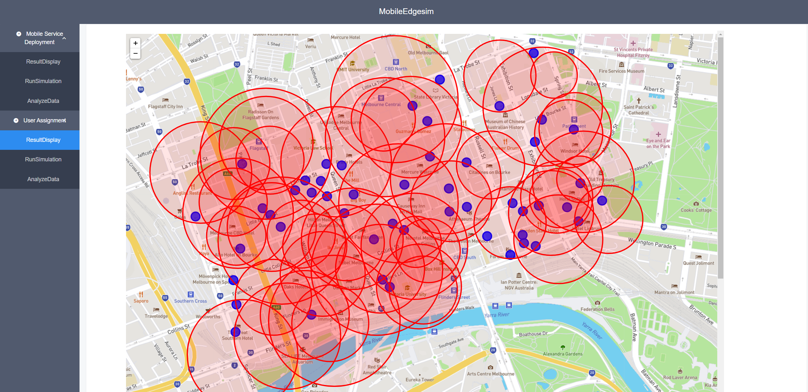
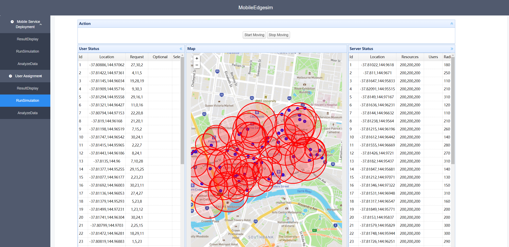
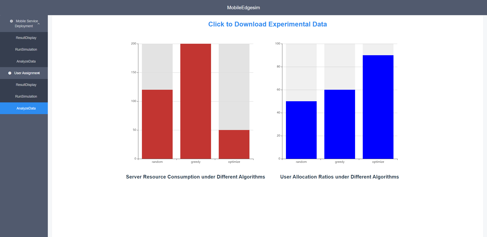

# MobileEdgesim
We developed a tool called MobileEdgesim designed to simulate microservices-oriented mobile edge computing environments.

# Abstract
Mobile edge computing (MEC) is an emerging computing paradigm that is receiving growing attention. MEC significantly reduces latency by processing user requests on edge servers rather than cloud centers, making it ideal for real-time applications. However, due to resource limitations and user mobility, microservice requests may fail, especially when users move at high speeds. This paper introduces a new tool, MobileEdgeSim, designed to simulate microservice-oriented MEC environments. MobileEdgeSim integrates mobility prediction and service composition to enhance the pre-deployment of microservices. To evaluate MobileEdgeSim, we conducted a series of experiments comparing it to several state-of-the-art baseline approaches. We also conducted a user study to evaluate the tool's effectiveness in real-world scenarios. Our results indicate that MobileEdgeSim significantly improves the success rate of both user requests and responses while reducing resource costs. 

***
**Model Architecture**


# MobileEdgesim Platform

This project is an edge computing simulation platform, including two modules of `service deployment` and `user assignment` under edge computing. For the service deployment and user assignment modules, please deploy the platform according to this document and test it on the front-end page.
We also provide a test video for reference.
A demo video of *MobileEdgesim* is at:
http://localhost:8080/

## Platform Architecture

The overall platform architecture is shown below:



## Platform deployment

### Web Front-End

The project `edge_front-master` is the front-end part, the front-end is written by React, please deploy it in a reverse proxy server, such as Nginx, the specific deployment method can be referred to:
[Front-End deploy guide](./edge_front-master/edge_front-master/readme.md)

The interface after deployment is as follows:

**fig1&2 Deploy Result & Deploy Configuration**



**fig3&4 Deploy Result Analysis & Allocate User Display**



**fig5&6 Allocate User Simulation & Allocate User Statistic**



### Back-End

The project `edge_backend-master` is the back-end part, the back-end is written by Django, for convenience, please try to deploy the back-end and front-end on the same physical machine, the deployment method of the back-end is the deployment method of the Django project, please refer to the online tutorials, or you can directly enter the command if you want to run it simply:

```bash
python manage.py runserver
```
